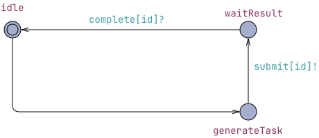
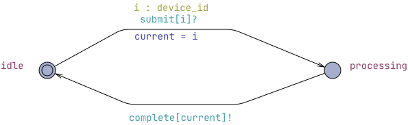
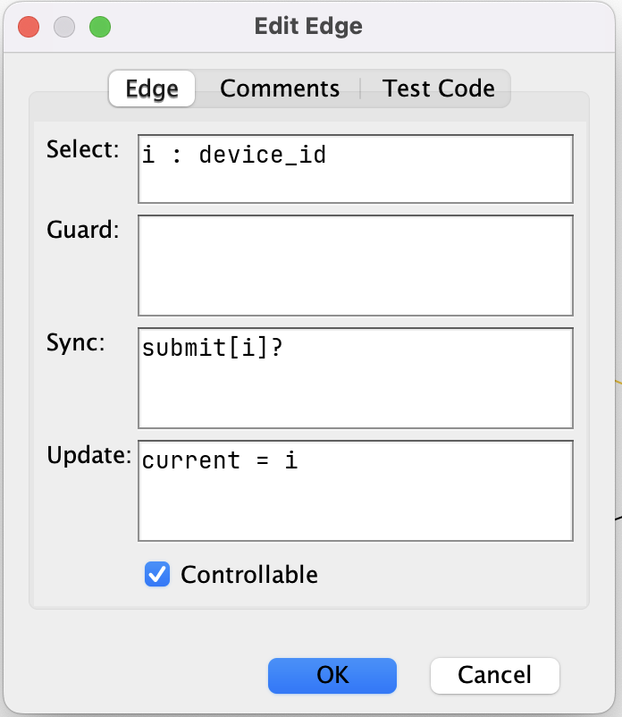
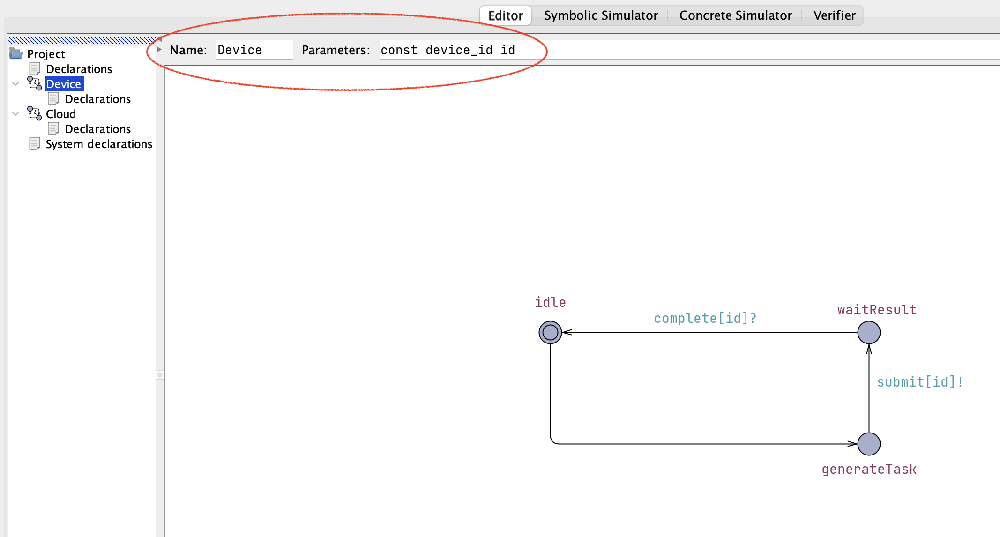
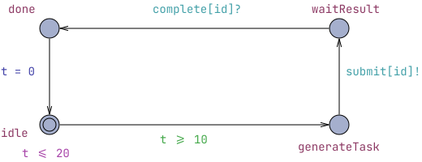
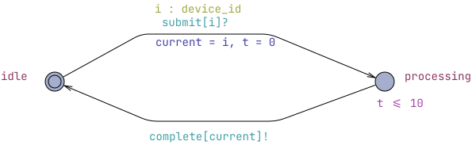

# Υλοποίηση IoT συστήματος με UPPAAL

## Εισαγωγή

μετρήσεις/διεργασίες. Αρχικά, οι συσκευές θα έχουν blocking συμπεριφορά, δηλαδή θα περιμένουν από το Cloud να τους απαντήσει πριν συνεχίσουν σε επόμενο task.

## Απλή υλοποίηση χωρίς ουρά

Το σύστημα αποτελείται από Ν IoT συσκευές που επικοινωνούν με ένα Cloud. Τα μοντέλα της συσκευής και του cloud φαίνονται παρακάτω.



*Figure 1. Device Automaton.*



*Figure 2. Cloud Automaton.*

Ορίζουμε τις παρακάτω global μεταβλητές. Έχουμε επιλέξει `Ν = 3` συσκευές αλλά το σύστημά μας είναι γενικευμένο και μπορούμε να επιλέξουμε οποιοδήποτε πλήθος συσκευών Ν.

``` uppaal
const int N = 3; // number of devices
typedef int[0,N-1] device_id;

chan submit[N], complete[N];
```

Χρειαζόμαστε `2*Ν` κανάλια συγχρονισμού. Ένα κανάλι `submit` μεταξύ κάθε συσκευής και του cloud ώστε να του στέλνει τις μετρήσεις/task και ένα κανάλι `complete` από το cloud προς την κάθε συσκευή όπου θα της επιστρέφει ότι ολοκληρώθηκε η επεξεργασία της μέτρησης/task.

Τοπικά, το cloud έχει μια μεταβλητή `device_id current` όπου αποθηκεύει ποιάς συσκευής το task επεξεργάζεται εκείνη τη χρονική στιγμή.

Κάθε συσκευή (Device) ακολουθεί έναν απλό κύκλο λειτουργίας αποτελούμενο από τρεις καταστάσεις. Αρχικά βρίσκεται στην κατάσταση `idle`, όπου δεν εκτελεί καμία ενέργεια. Όταν αποφασίσει να δημιουργήσει μια νέα εργασία, μεταβαίνει στην κατάσταση `generateTask` και συγχρονίζεται με το Cloud μέσω του καναλιού `submit[id]!`, αποστέλλοντας το αίτημά της. Αμέσως μετά εισέρχεται στην κατάσταση `waitResult`, όπου παραμένει μέχρι να λάβει ειδοποίηση ολοκλήρωσης μέσω του καναλιού `complete[id]?`. Με την παραλαβή του αποτελέσματος επιστρέφει στην κατάσταση `idle`, έτοιμη να ξεκινήσει έναν νέο κύκλο δημιουργίας εργασίας. Με τον τρόπο αυτό κάθε συσκευή μπορεί να έχει το πολύ μία εκκρεμή εργασία κάθε χρονική στιγμή.

Το Cloud μοντελοποιείται ως ένας απλός εξυπηρετητής με δύο καταστάσεις: `idle` και `processing`. Όσο βρίσκεται στην κατάσταση `idle`, είναι διαθέσιμο να δεχθεί ένα νέο αίτημα από οποιαδήποτε συσκευή. Η μετάβαση πραγματοποιείται μέσω του συγχρονισμού `submit[i]?`, όπου η εντολή **select** επιλέγει ποια συσκευή υπέβαλε το αίτημα και αποθηκεύει το αναγνωριστικό της στη μεταβλητή `current`. Στη συνέχεια το Cloud μεταβαίνει στην κατάσταση `processing`, κατά την οποία θεωρείται ότι επεξεργάζεται την εργασία. Στην παρούσα έκδοση η επεξεργασία θεωρείται στιγμιαία και δεν λαμβάνεται υπόψη κάποια χρονική καθυστέρηση. Με την ολοκλήρωση της επεξεργασίας αποστέλλεται μήνυμα complete`[current]!` στην αντίστοιχη συσκευή και το Cloud επιστρέφει στην κατάσταση `idle`, ώστε να εξυπηρετήσει το επόμενο αίτημα. Εφόσον δεν υπάρχει μηχανισμός αποθήκευσης αιτημάτων, το Cloud μπορεί να εξυπηρετεί μόνο μία εργασία κάθε φορά και νέα αιτήματα γίνονται αποδεκτά μόνο όταν αυτό είναι διαθέσιμο.

### Edge select

[Όταν είχαμε δει τον συγχρονισμό, τα guards και τα updates ως ιδιότητες των ακμών](lamp.md#λάμπα-με-χρονοδιακόπτη), δεν είχαμε αναφερθεί σε μια ακόμα, το **select**.

Η **ετικέτα** select χρησιμοποιείται όταν μια μετάβαση πρέπει να μπορεί να εκτελεστεί για περισσότερες από μία πιθανές τιμές. Στο παράδειγμά μας χρησιμοποιείται η δήλωση `i : device_id`, η οποία σημαίνει ότι η μεταβλητή i μπορεί να πάρει οποιαδήποτε τιμή του τύπου `device_id` (δηλαδή οποιοδήποτε αναγνωριστικό συσκευής). Για κάθε δυνατή τιμή δημιουργείται ουσιαστικά μια ξεχωριστή εκδοχή της ίδιας μετάβασης. Έτσι, όταν το Cloud βρίσκεται στην κατάσταση `idle`, μπορεί να συγχρονιστεί με οποιοδήποτε κανάλι `submit[i]?` είναι διαθέσιμο εκείνη τη στιγμή. Αμέσως μετά τον συγχρονισμό, η τιμή του i αποθηκεύεται στη μεταβλητή `current`, ώστε το Cloud να γνωρίζει από ποια συσκευή προήλθε η εργασία και να αποστείλει αργότερα το μήνυμα ολοκλήρωσης στη σωστή συσκευή μέσω του `complete[current]!`.



*Figure 3. Edge menu.*

### Templates στο UPPAAL

Κρίνεται σκόπιμο να εξηγήσουμε την χρήσιμη λειτουργία των templates στο UPPAAL, που εδώ την έχουμε αξιοποιήσει για τα αυτόματα device.

Τα templates στο UPPAAL λειτουργούν ως πρότυπα για τη δημιουργία διεργασιών με ίδια συμπεριφορά. Καθώς πολύ συχνά τα συστήματα αποτελούνται από πολύ παρόμοιες διεργασίες όπου όλη η δομή του ελέγχου (οι καταστάσεις και οι μεταβάσεις) είναι ίδιες και διαφέρουν μόνο σε κάποια μεταβλητή ή σταθερά. Έτσι συμβαίνει στο σύστημά μας με τις συσκευές.

Αντί να σχεδιάζεται ξεχωριστό αυτόματο για κάθε συσκευή, ορίζεται ένα μόνο template Device, το οποίο περιγράφει τη λειτουργία μιας γενικής συσκευής. Στη συνέχεια, κατά τη σύνθεση του συστήματος, το UPPAAL δημιουργεί πολλαπλά στιγμιότυπα (instances) του ίδιου template. Στο παράδειγμά μας χρησιμοποιείται η δήλωση `system Device, Cloud;`, η οποία, σε συνδυασμό με την παράμετρο `const device_id id` του template, δημιουργεί αυτόματα μία διεργασία Device για κάθε δυνατή τιμή του τύπου `device_id`, δηλαδή συνολικά N συσκευές. Κάθε στιγμιότυπο διαθέτει τη δική του τιμή της παραμέτρου `id`, γεγονός που του επιτρέπει να επικοινωνεί μέσω των αντίστοιχων καναλιών `submit[id]` και `complete[id]`, χωρίς να απαιτείται η δημιουργία διαφορετικών αυτομάτων για κάθε συσκευή.



*Figure 4. Device template.*

Όσον αφορά τη σύνταξη που χρησιμοποιήσαμε στα System Declarations, επειδή το template Device είναι παραμετροποιημένο (`const device_id id`), το UPPAAL κάνει αυτόματα replication για κάθε τιμή του scalar τύπου `device_id`.

Έτσι για την αρχικοποίηση του συστήματος αρκεί το:

``` uppaal
system Device, Cloud;
```

και δεν χρειάζεται να γράψουμε κάτι τέτοιο:

``` uppaal
Device0 = Device(0);
Device1 = Device(1);
Device2 = Device(2);
Cloud = Cloud();
```

### Προσθήκη Ρολογιού

Δεν έχουμε συγκεκριμένες προδιαγραφές αλλά θα ορίσουμε κάποια χρονικά όρια για να παρατηρήσουμε τις συμπεριφορές που προκύπτουν. Ορίζουμε τοπική μεταβλητή `clock t` για κάθε αυτόματο.

Έστω ότι οι συσκευές παράγουν ένα νέο task/ μια νέα μέτρηση ανάμεσα σε κάθε 10 και 20 χρονικές μονάδες.

Αυτό θα μοντελοποιηθεί με τον [συνδυασμό guard και invariant](traffic_lights.md#tip). Με το **invariant** t ≤ 20 στο `idle` ορίζουμε οτι το αυτόματο μπορεί να μείνει εκεί το πολύ για 20 χρονικές μονάδες. Με το **guard** t ≥ 10 στην ακμή από το idle στο generateTask ορίζουμε οτι η μετάβαση ενεργοποιείται μετά από τις 10 χρονικές μονάδες. Με το update `t = 0` το ρολόι γίνεται reset στην μετάβαση από τη νέα κατάσταση `done` προς το `idle`.



*Figure 5. Device Automaton updated.*

Εστω ότι το cloud χρειάζεται ανάμεσα σε 0 και 10 χρονικές μονάδες για να επεξεργαστεί το κάθε task/μέτρηση.



*Figure 6. Cloud Automaton updated.*

Μηδενίζουμε το ρολόι στη μετάβαση από το `idle` στο `processing`. Εκεί, υπάρχει invariant t ≤ 10 ώστε να μοντελοποιήσουμε τη συμπεριφορά ότι η επεξεργασία κάθε εργασίας παίρνει το πολύ 10 χρονικές μονάδες.

#### Γιατί προσθέσαμε μια νέα κατάσταση done στο device

Η αρχική μας σκέψη ήταν το ρολόι να μηδενίζεται κατά τη μετάβαση από το `idle` στο `generateTask`. Όμως σε αυτήν την περίπτωση, η συνθήκη t >= 10 δεν θα μπορούσε ποτέ να ικανοποιηθεί, καθώς το ρολόι θα επανεκκινούσε σε κάθε νέο κύκλο λειτουργίας. Αντίθετα, η μετάβαση από την `done` προς την `idle` εκτελεί την ανάθεση `t = 0`, ώστε κάθε συσκευή να ξεκινά τη μέτρηση του χρόνου για την επόμενη εργασία μόνο αφού έχει ολοκληρωθεί ο προηγούμενος κύκλος επεξεργασίας. Με τον τρόπο αυτό διατηρείται η επιθυμητή χρονική συμπεριφορά του μοντέλου.

### Queries

Με τα παρακάτω query επιβεβαιώνουμε οτι η συσκευές μπορούν να ολοκληρώσουν τις διαδικασίες τους.

``` query
E<> Device(0).done
E<> Device(1).done
E<> Device(2).done
```

Και ότι το σύστημα δεν πέφτει σε deadlock.

``` query
A[] not deadlock
```

### Version 1 xml

Μπορείτε να δείτε το παραπάνω σύστημα στο UPPAAL ανοίγοντας αυτό το αρχείο xml: [IoTSystemV1.xml](models/IoTSystemV1.xml)
