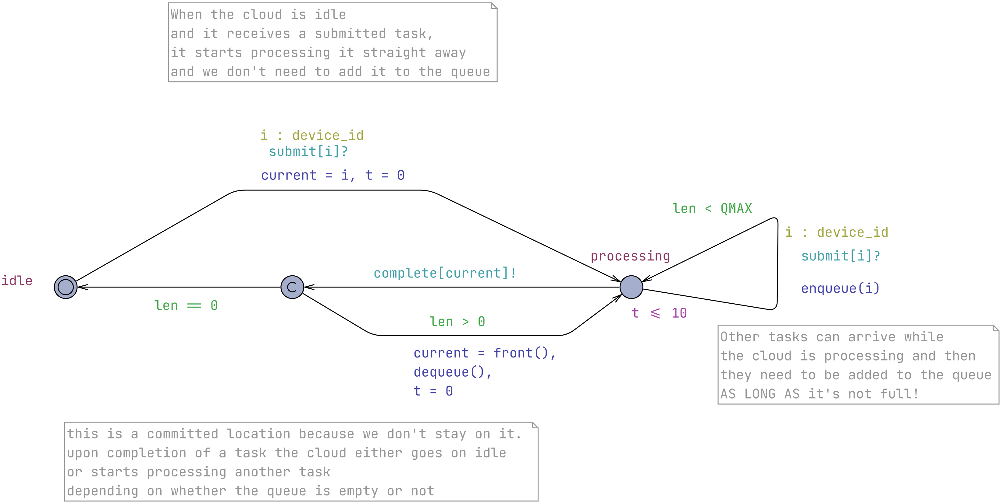
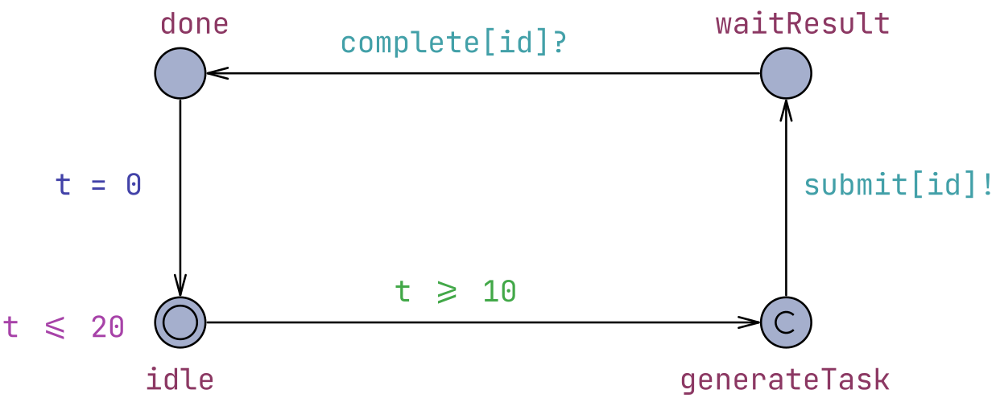
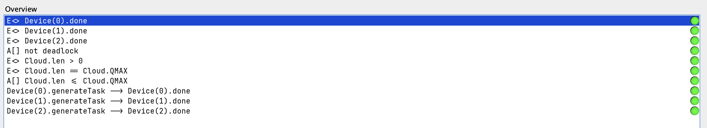

# Υλοποίηση IoT συστήματος με UPPAAL - Μέρος 2ο

## Περιγραφή συστήματος

Συνεχίζουμε από το σημείο όπου φτάσαμε στο [πρώτο μέρος](IoTSystemV1.md). Στο τωρινό μας σύστημα, το Cloud μπορεί να δεχθεί νέο αίτημα μόνο όταν βρίσκεται στην κατάσταση `idle`. Αν μια συσκευή ολοκληρώσει τη δημιουργία μιας εργασίας ενώ το Cloud επεξεργάζεται ήδη κάποια άλλη, η εργασία δεν μπορεί να αποθηκευτεί προσωρινά και η συσκευή αναγκάζεται να περιμένει μέχρι να ελευθερωθεί ο εξυπηρετητής.

Το επόμενο βήμα για να υλοποιήσουμε ένα πιο ρεαλιστικό σύστημα είναι η προσθήκη μιας ουράς (queue), η οποία επιτρέπει στο Cloud να αποθηκεύει τα εισερχόμενα αιτήματα και να τα επεξεργάζεται με τη σειρά άφιξής τους.

## Yλοποίηση με ουρά

Στο template του Cloud προστίθεται μια απλή ουρά (queue) σταθερού μεγέθους. Η ουρά υλοποιείται ως ένας πίνακας `list` χωρητικότητας `QMAX`, ενώ η μεταβλητή `len` αποθηκεύει κάθε στιγμή το πλήθος των στοιχείων που περιέχει. Για τη διαχείρισή της υλοποιούνται τρεις βοηθητικές συναρτήσεις `enqueue()`, `dequeue()` και `front()`. Η υλοποίηση παρατίθεται παρακάτω.

Σημειώνεται ότι η ουρά αποθηκεύει μόνο τα `device_id` της συσκευής από την οποία προέρχεται για κάθε εργασία. Στο συγκεκριμένο μοντέλο, κάθε συσκευή μπορεί να έχει το πολύ μία εκκρεμή εργασία κάθε χρονική στιγμή (blocking μέχρι να πάρει απάντηση από το Cloud), επομένως το αναγνωριστικό της συσκευής είναι αρκετό. Θα επεκτείνουμε αργότερα το μοντέλο ώστε οι συσκευές να έχουν non-blocking λειτουργία.

``` uppaal
// Queue functions
const int QMAX = 2; // queue size (capacity)
device_id list[QMAX];
int[0,QMAX] len = 0; // initialize length

// Put an element at the end of the queue
void enqueue(device_id element)
{
        list[len++] = element;
}

// Remove the front element of the queue
void dequeue()
{
        int i = 0;
        len -= 1;
        while (i < len)
        {
                list[i] = list[i + 1];
                i++;
        }
        list[i] = 0;
}

// Returns the front element of the queue
device_id front()
{
   return list[0];
}
```

Όταν το Cloud βρίσκεται στην κατάσταση `idle`, η συμπεριφορά του παραμένει ουσιαστικά ίδια: με την παραλαβή ενός αιτήματος μέσω του `submit[i]?` ξεκινά αμέσως την επεξεργασία του, χωρίς να το τοποθετεί στην ουρά καθώς δεν χρειάζεται.

Αντίθετα, όταν βρίσκεται ήδη στην κατάσταση `processing`, μπορεί πλέον να δεχθεί επιπλέον αιτήματα μέσω του self-transition της κατάστασης. Κάθε νέο αίτημα εισάγεται στο τέλος της ουράς με τη συνάρτηση `enqueue()`, εφόσον υπάρχει διαθέσιμη χωρητικότητα (`len < QMAX`). Με τον τρόπο αυτό, το Cloud συνεχίζει την επεξεργασία της τρέχουσας εργασίας, ενώ οι υπόλοιπες περιμένουν τη σειρά τους.

Επιπλέον, αντί το Cloud να επιστρέφει απευθείας στην κατάσταση `idle`, εισάγεται η ενδιάμεση **committed** κατάσταση. Η κατάσταση αυτή χρησιμοποιείται αποκλειστικά για τη λήψη της επόμενης απόφασης και δεν επιτρέπει την πάροδο του χρόνου. Αν η ουρά είναι κενή (`len == 0`), το Cloud επιστρέφει στην κατάσταση idle και αναμένει νέο αίτημα. Αντίθετα, όταν υπάρχουν εκκρεμείς εργασίες (`len > 0`), ανακτά το πρώτο στοιχείο της ουράς μέσω της `front()`, το αφαιρεί με τη `dequeue()`, επαναφέρει το ρολόι (`t = 0`) και μεταβαίνει ξανά στην κατάσταση `processing` για την εξυπηρέτηση της επόμενης εργασίας. Με τον τρόπο αυτό το Cloud επεξεργάζεται συνεχόμενα όλες τις εργασίες που βρίσκονται στην ουρά, χωρίς να παρεμβάλλεται περιττή παραμονή στην κατάσταση `idle`.

Προς το παρόν, δεν χρειάζεται να γίνει κάποια αλλαγή στο template της συσκευής, οπότε δείχνουμε παρακάτω μόνο το μοντέλο του Cloud.



*Figure 1. Cloud Automaton.*

### Committed Locations

Η νέα κατάσταση που έχουμε προσθέσει είναι τύπου **committed**. Θυμίζουμε ότι οι committed καταστάσεις είναι καταστάσεις όπου δεν περνάει ο χρόνος και δεν μεσολαβούν άλλα γεγονότα όσο παραμένουμε σε αυτές. Όταν η συνολική κατάσταση του συστήματος περιλαμβάνει μια κατάσταση τύπου committed, οι μόνες ενεργοποιημένες μεταβάσεις είναι αυτές που ξεκινάνε (outgoing) από την committed κατάσταση.

Χρησιμοποιούνται για να εισάγουν μια λογική διακλάδωση (not to be confused με τα πιθανοτικά branches). Θέλουμε "αμέσως" μετά την ολοκλήρωση του `processing` να επιστρέψει είτε ξανά στο processing για την επόμενη εργασία, είτε στο `idle`, ανάλογα με την τιμή του `len` οπότε χρησιμοποιούμε committed κατάσταση με τα αντίστοιχα guards ως συνθήκες στις μεταβάσεις.

Πλέον έχουμε ένα ολοκληρωμένο σύστημα με ουρά και παρατηρώντας το στον simulator βλέπουμε ότι λειτουργεί όπως περιμέναμε. Δοκιμάζουμε το παρακάτω query, για να επιβεβαιώσουμε ότι η κατάσταση `generateTask` οδηγεί πάντοτε στην κατάσταση `done`. Δηλαδή ότι, κάθε εργασία που δημιουργείται από τη συσκευή ολοκληρώνεται τελικά.

``` query
Device(0).generateTask --> Device(0).done
```

Βλέπουμε ότι δεν ικανοποιείται. Συμβαίνει επειδή δεν υπάρχει κάποια συνθήκη προόδου από το `generateTask` (όπως θα ήταν για παράδειγμα κάποιο invariant). Μετά την ικανοποίηση της συνθήκης `t >= 10` μπορεί να μεσολαβήσει αυθαίρετο χρονικό διάστημα στην κατάσταση πριν εκτελεστεί ο συγχρονισμός `submit[id]!`. Ωστόσο νοηματικά δεν υπάρχει λόγος για την συσκευή να μην κάνει submit την εργασία αμέσως μετά τη δημιουργία της.

Συμπεραίνουμε την ανάγκη για άλλη μια committed κατάσταση. Αλλάζουμε τον τύπο του `generateTask` σε committed ώστε η υποβολή της εργασίας να πραγματοποιείται αμέσως μόλις ολοκληρωθεί η περίοδος δημιουργίας της. Το ανανεωμένο αυτόματο φαίνεται παρακάτω.



*Figure 2. Device Automaton.*

Το query `Device(0).generateTask --> Device(0).done` είναι πλέον αληθές.

### Queries

Συγκεντρώνουμε τα queries που προσθέσαμε σε αυτά του προηγούμενου μέρους παρακάτω:

``` query
E<> Cloud.len > 0
E<> Cloud.len == Cloud.QMAX
A[] Cloud.len <= Cloud.QMAX
Device(0).generateTask --> Device(0).done
Device(1).generateTask --> Device(1).done
Device(2).generateTask --> Device(2).done
```

Τα 3 πρώτα ελέγχουν με τη σειρά ότι εργασίες μπορούν να προστεθούν στην ουρά, ότι η ουρά μπορεί να γεμίσει και ότι η ουρά δεν υπερχειλίζει ποτέ. Ακολουθούν τα queries που επαληθεύουν την πρόοδο των devices που είδαμε πριν.



*Figure 3. Query results.*

### Αυξάνοντας το πλήθος των συσκευών

Θυμίζουμε ότι στο σύστημά μας έχουμε ορίζει μια σταθερά Ν ως το πλήθος των συσκευών και μια σταθερά QMAX ως τη χωρητικότητα της ουράς. Για αρχή, οι τιμές που τους δώσαμε ήταν 3 και 2. Όλα τα παραπάνω ισχύουν για αυτές τις τιμές όμως αν αυξήσουμε το πλήθος των συσκευών χωρίς να μεγαλώσουμε την ουρά, αξίζει να μελετήσουμε αν συνεχίζουν να ισχύουν οι παραπάνω ιδιότητες.

## Version 2 xml

Μπορείτε να δείτε το παραπάνω σύστημα στο UPPAAL ανοίγοντας αυτό το αρχείο xml: [IoTSystemV2.xml](models/IoTSystemV2.xml)
