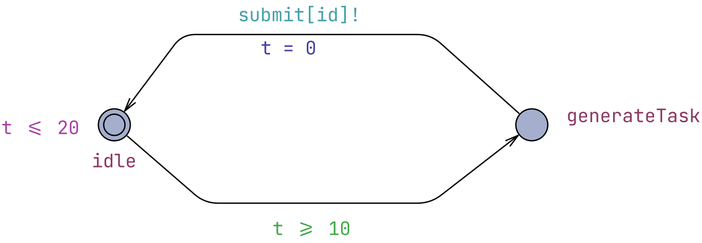
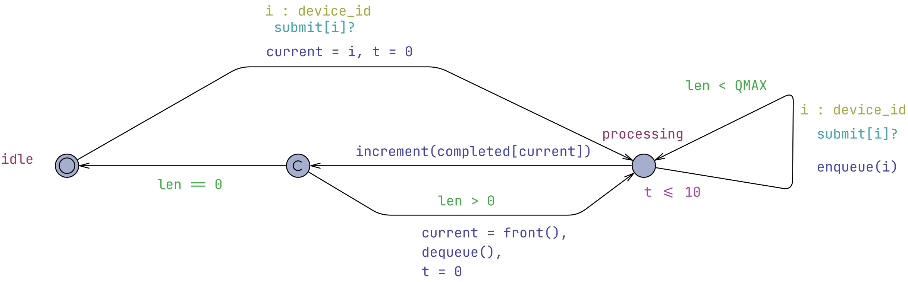
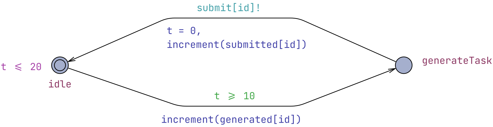
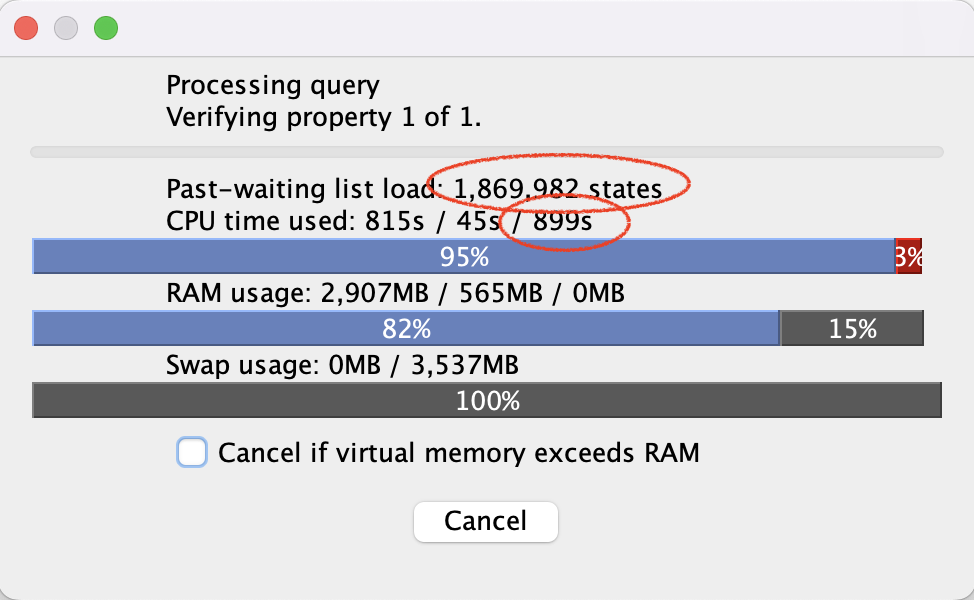
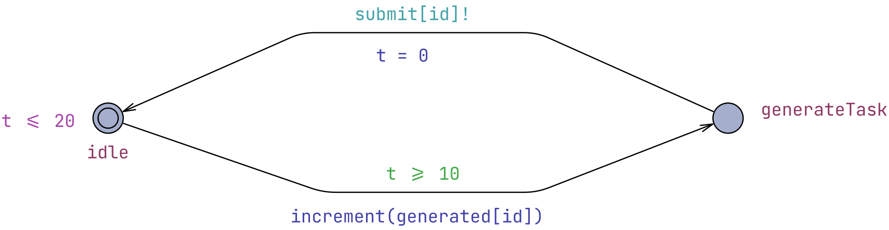
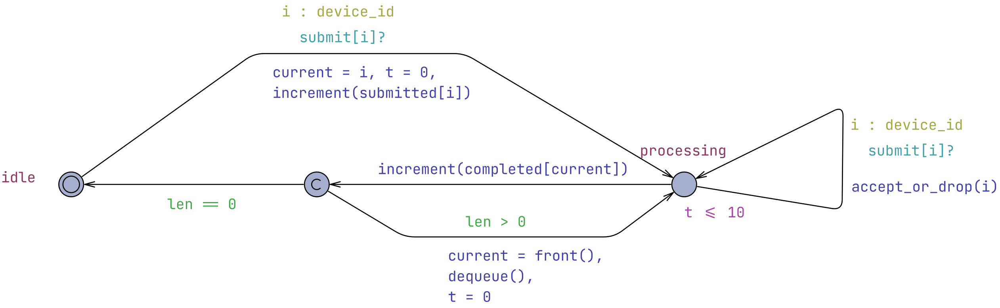

# Υλοποίηση IoT συστήματος με UPPAAL - Μέρος 3ο

## Περιγραφή συστήματος

Συνεχίζουμε από το σημείο όπου φτάσαμε στο [δεύτερο μέρος](IoTSystemV2.md). Στο μοντέλο μας οι συσκευές . Άρα το μέγιστο πλήθος των εργασιών είναι Ν.

Μια πιο ρεαλιστική IoT συσκευή συνεχίζει να παράγει μετρήσεις και να τις στέλνει στο cloud χωρίς να περιμένει απάντηση από αυτό και ετσι χωρίς να υπάρχει ο περιορισμός των Ν το πολύ εργασιών για το cloud στο σύστημα. Αυτό θα υλοποιήσουμε παρακάτω.

## Κάνοντας τις συσκευές non-blocking

Καθώς πλέον οι συσκευές δε θα περιμένουν κάποια απάντηση από το cloud, διαγράφουμε την κατάσταση `waitResult` και το κανάλι συγχρονισμού complete. Τώρα χρειάζεται συγχρονισμός μόνο στο submit.



*Figure 1. Device Automaton.*

Ωστόσο θέλουμε να ξέρουμε πόσες εργασίες ολοκληρώνονται οπότε ορίζουμε έναν μετρητή.

``` uppaal
int completed[N];
```

Στο Cloud αντικαθιστούμε το συγχρονισμό `complete[current]!` με update της μεταβλητής completed στο ίδιο σημείο.



*Figure 2. Cloud Automaton.*

Μάλιστα για να συγκρίνουμε αργότερα τις τιμές θα ορίσουμε μετρητές και για τις εργασίες που δημιουργούνται και στέλνονται στο cloud. Πάλι ανά συσκευή και άρα σε πίνακες μεγέθους Ν.

``` uppaal
const int CMAX = 100;

int[0, CMAX] completed[N]; // number of tasks completed (processed by the cloud) for each device

int[0, CMAX] generated[N]; // number of tasks generated by each device
int[0, CMAX] submitted[N]; // number of tasks generated and submitted to the cloud, by each device

void increment(int[0, CMAX] &counter)
{
    if (counter < CMAX)
        counter++;
}
```

Για την παρακολούθηση της συμπεριφοράς του συστήματος χρησιμοποιούμε τρεις μετρητές για κάθε συσκευή. Οι μετρητές αυτοί έχουν μέγιστη τιμή CMAX. Μόλις ένας μετρητής φτάσει αυτή την τιμή, δεν αυξάνεται περαιτέρω. Με αυτόν τον τρόπο αποφεύγεται η υπερχείλιση των ακεραίων (integer overflow) κατά την εκτέλεση μεγάλων προσομοιώσεων. Γι' αυτό έχουμε ορίσει και καλούμε μια συνάρτηση increment που ελέγχει το CMAX αντί να αυξάνουμε απευθείας τις τιμές των μετρητών απευεθίας.

Στο αυτόματο αυξάνουμε τους μετρητές generated και submitted όταν δημιουργείται και όταν στέλνεται μια εργασία στο cloud αντίστοιχα.



*Figure 3. Device Automaton updated.*

## Queries

Θα εκτελέσουμε κάποια queries για να επιβεβαιώσουμε την αναμενόμενη συμπεριφορά του συστήματος.

```uppaal
E<> completed[0] > 0
```

Αρχικά ελέγχουμε ότι μπορεί να ολοκληρωθεί τουλάχιστον μια εργασία της συσκευής 0. Κάτι άλλο που μπορούμε να ελέγξουμε είναι ότι υπάρχει εκτέλεση όπου ολοκληρώνεται τουλάχιστον μια εργασία για κάθε συσκευή. Αυτό το εκφράζουμε ως εξής:

```uppaal
E<> forall(i : device_id) (completed[i] > 0)
```

Στη συνέχεια, ελέγχουμε ότι μπορεί να υπάρξουν, σε κάποιο σημείο, εργασίες που έχουν υποβληθεί στο cloud αλλά δεν έχουν ολοκληρωθεί:

```uppaal
E<> submitted[0] > completed[0]
```

### State-space explosion

Έπειτα, θα θέλαμε να επαληθεύσουμε ότι ο αριθμός των ολοκληρωμένων εργασιών μιας συσκευής δεν ξεπερνά ποτέ τον αριθμό των εργασιών που έχουν υποβληθεί. Η φυσική διατύπωση είναι:

```uppaal
A[] completed[0] <= submitted[0]
```

Ωστόσο, στο συγκεκριμένο μοντέλο η επαλήθευση δεν ολοκληρώνεται σε πρακτικό χρόνο, ακόμη και για μικρές τιμές των N και QMAX.



*Figure 4. Processing the query.*

Αυτό συμβαίνει επειδή, οι μετρητές αποτελούν μέρος της κατάστασης του συστήματος. Κάθε νέος συνδυασμός τιμών των generated, submitted και completed, για κάθε μια από τις Ν συσκευές, δημιουργεί διαφορετική κατάσταση. Τα γενικευμένα χρονισμένα αυτόματα του UPPAAL έχουν έναν χώρο καταστάσεων που δεν περιορίζεται μόνο από τις καταστάσεις και το ρολόι αλλά και από όλες τις πιθανές τιμές των μεταβλητών και δομών δεδομένων. Εδώ, για Ν = 3, έχουμε 9 integer μεταβλητές μετρητών (*completed[0], completed[1], completed[2], generated[0], generated[1], generated[2], submitted[0], submitted[1], submitted[2]*) και η κάθε μια από αυτές παίρνει τιμές από 0 έως CMAX.

Παράλληλα, οι συσκευές πλέον λειτουργούν ανεξάρτητα από την ολοκλήρωση των προηγούμενων εργασιών τους. Έτσι μπορούν να παράγουν νέες εργασίες ταυτόχρονα, αυξάνοντας σημαντικά τον αριθμό των δυνατών αλληλουχιών εκτέλεσης του συστήματος.

Το φαινόμενο αυτό είναι γνωστό ως έκρηξη του χώρου καταστάσεων (state-space explosion) και αποτελεί έναν από τους σημαντικότερους περιορισμούς της εξαντλητικής επαλήθευσης (exhaustive verification). Καθώς αυξάνεται η πολυπλοκότητα του μοντέλου, ο αριθμός των καταστάσεων που πρέπει να εξεταστούν μπορεί να αυξηθεί εκθετικά, με αποτέλεσμα ακόμη και απλές ιδιότητες να μην μπορούν να επαληθευτούν σε πρακτικό χρόνο.

Το συγκεκριμένο query είναι ιδιαίτερα απαιτητικό, επειδή πρόκειται για καθολική ιδιότητα (`A[]`). Για να αποδείξει ότι το σύστημα δεν μπορεί να οδηγηθεί σε deadlock, το UPPAAL πρέπει να εξερευνήσει ολόκληρο τον προσβάσιμο χώρο καταστάσεων. Αντίθετα, υπαρξιακά queries, όπως το `E<> Cloud.len == Cloud.QMAX`, μπορούν να τερματίσουν μόλις εντοπιστεί μία εκτέλεση που ικανοποιεί την ιδιότητα, γεγονός που τα καθιστά συνήθως πολύ ταχύτερα.

#### Ανάγκη για Statistical Model Checking (SMC)

Μέχρι τώρα χρησιμοποιήσαμε τις δυνατότητες του κλασικού UPPAAL για την εξαντλητική επαλήθευση (exhaustive verification) ιδιοτήτων του μοντέλου. Όπως είδαμε όμως, όσο αυξάνεται η πολυπλοκότητα του συστήματος, η πλήρης εξερεύνηση του χώρου καταστάσεων γίνεται ολοένα και πιο απαιτητική. Στο επόμενο κεφάλαιο θα δούμε πώς το Statistical Model Checking (SMC) προσφέρει μια εναλλακτική προσέγγιση για την ανάλυση τέτοιων συστημάτων μέσω στατιστικών προσομοιώσεων.

### Όταν γεμίζει η ουρά

Χρειάζεται να αποφασίσουμε σχεδιαστικά πως θα συμπεριφέρεται το σύστημα μας όταν η ουρά είναι γεμάτη. Δυο πιθανές επιλογές είναι:

1. οι συσκευές που θέλουν να στείλουν κάποια εργασία περιμένουν
2. η εργασία απορρίπτεται (dropped)

Θα ακολουθήσουμε το 2, αφού έχουμε αποδεχτεί την πιο ρεαλιστική συμπεριφορά των συσκευών IoT να στέλνουν τις εργασίες/μετρήσεις τους ανεξάρτητα από συγχρονισμό με το cloud.

Τώρα η βασική αλλαγή είναι να επιτρέψουμε στο Cloud να συγχρονίζεται με τη συσκευή και όταν η ουρά είναι πλήρης, αλλά χωρίς να εκτελεί το enqueue.

Ορίζουμε άλλη μια βοηθητική συνάρτηση, την `accept_or_drop`:

```uppaal
void accept_or_drop(device_id i)
{
    if (len < QMAX)
    {
        enqueue(i);
        increment(submitted[i]);
    }
}
```

Καλούμε την `accept_or_drop` στο self-transition της **processing**. Χρειάζεται επιπλέον να αφαιρέσουμε το guard `len < QMAX`. Έτσι τώρα όταν `len == QMAX`: ο συγχρονισμός `submit[i]! / submit[i]?` εξακολουθεί να γίνεται, η συσκευή επιστρέφει στο *idle*, η εργασία δεν μπαίνει στην ουρά και το `submitted[i]` δεν αυξάνεται. Τέλος, έχουμε μεταφέρει την άυξηση των μετρητών submitted στο αυτόματο του cloud, αφού πλέον δεν γίνονται όλες οι εργασίες δεκτές.

Έτσι η συσκευή δεν μπλοκάρει και η διαφορά `generated[i] - submitted[i]` μετρά τις εργασίες που δημιουργήθηκαν αλλά απορρίφθηκαν.



*Figure 5. Final device automaton.*



*Figure 6. Final cloud automaton.*

#### Query

Ένα query που δείχνει ότι κάποιες εργασίες απορρίπτονται από την ουρά είναι το παρακάτω.

```query
E<> Device(0).idle && generated[0] > submitted[0]
```

H συσκευή έχει ολοκληρώσει την προσπάθεια υποβολής και έχει επιστρέψει στο idle. Αν η διαφορά παραμένει, τότε τουλάχιστον μία εργασία δημιουργήθηκε αλλά δεν έγινε δεκτή από το Cloud.

## Version 3 xml

Μπορείτε να δείτε το παραπάνω σύστημα στο UPPAAL ανοίγοντας αυτό το αρχείο xml: [IoTSystemV3.xml](models/IoTSystemV3.xml)
