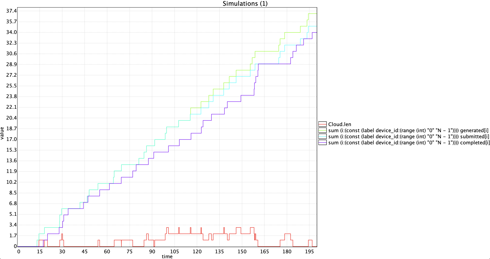
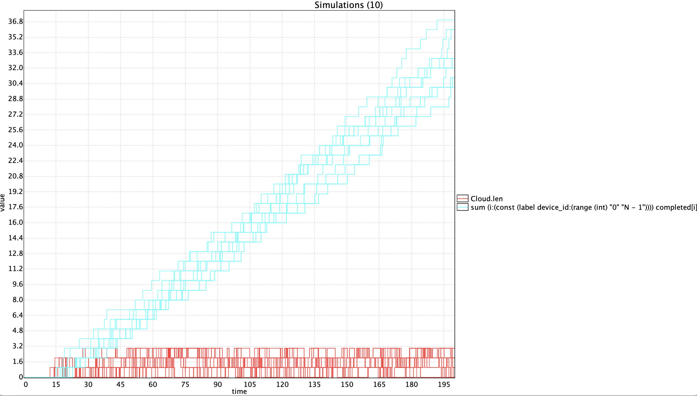
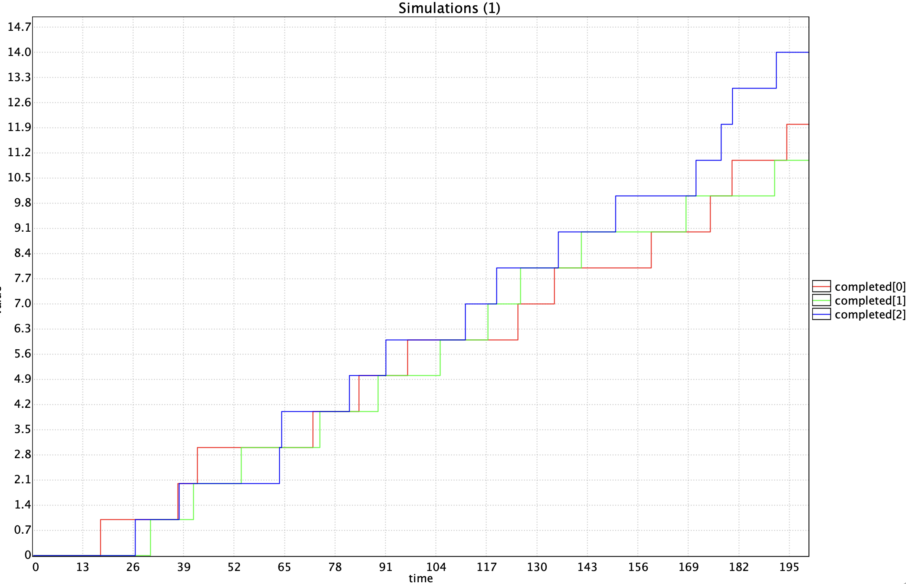
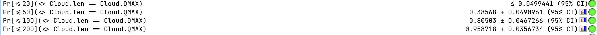
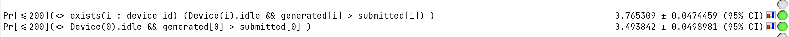
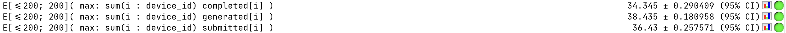

# Υλοποίηση IoT συστήματος με UPPAAL - Μέρος 4o

## Περιγραφή συστήματος

Συνεχίζουμε από το σημείο όπου φτάσαμε στο [τρίτο μέρος](IoTSystemV3.md).

Δε θα αλλάξουμε άλλο το μοντέλο μας προς το παρόν πέρα από μια αναγκαία αλλαγή σχετικά με τα κανάλια submit.

```uppaal
urgent broadcast chan submit[N];
```

Το κανάλι χρειάζεται να γίνει `broadcast` λόγω [περιορισμού του UPPAAL SMC](https://docs.uppaal.org/language-reference/system-description/semantics/#smc-limitations).

## Statistical Model Checking

Στα προηγούμενα μέρη χρησιμοποιήσαμε την κλασική, εξαντλητική επαλήθευση του UPPAAL για να εξετάσουμε ιδιότητες του μοντέλου. Όσο όμως το σύστημα γίνεται πιο σύνθετο, με περισσότερες συσκευές, ουρά, ταυτόχρονες υποβολές εργασιών και μετρητές, ο χώρος καταστάσεων αυξήθηκε σημαντικά και ορισμένα καθολικά queries έγιναν πολύ αργά ή πρακτικά αδύνατο να ολοκληρωθούν. Σε αυτό το σημείο είναι χρήσιμο το **Statistical Model Checking (SMC**), το οποίο δεν εξερευνά όλες τις δυνατές εκτελέσεις, αλλά βασίζεται σε μεγάλο αριθμό στοχαστικών προσομοιώσεων και εξάγει στατιστικές εκτιμήσεις για τη συμπεριφορά του συστήματος.

Στο τέταρτο μέρος θα χρησιμοποιήσουμε το UPPAAL SMC για να μελετήσουμε το ίδιο μοντέλο από πλευράς απόδοσης και πιθανότητας. Θα εξετάσουμε, για παράδειγμα πόσο συχνά γεμίζει η ουρά, ποια είναι η πιθανότητα να απορριφθεί κάποια εργασία, πόσες εργασίες ολοκληρώνονται κατά μέσο όρο μέσα σε ένα χρονικό διάστημα και πώς αλλάζουν τα αποτελέσματα όταν μεταβάλλεται ο αριθμός των συσκευών ή η χωρητικότητα της ουράς. Τα αποτελέσματα του SMC αποτελούν εκτιμήσεις με συγκεκριμένο επίπεδο εμπιστοσύνης, οι οποίες είναι ιδιαίτερα χρήσιμες όταν η πλήρης εξερεύνηση του μοντέλου δεν είναι πρακτική.

### Προσομοιώσεις

Στο δικό μας μοντέλο, κάθε συσκευή παραμένει στην κατάσταση *idle* για χρονικό διάστημα μεταξύ 10 και 20 μονάδων, λόγω του guard t >= 10 και του invariant t <= 20. Εφόσον υπάρχει άνω χρονικό όριο, το UPPAAL SMC επιλέγει την καθυστέρηση από ομοιόμορφη κατανομή μέσα στο επιτρεπτό διάστημα. Αντίστοιχα, το Cloud παραμένει στην κατάσταση *processing* από 0 έως 10 χρονικές μονάδες, επομένως και ο χρόνος επεξεργασίας επιλέγεται στοχαστικά από αυτό το διάστημα. Οι διαφορετικές συσκευές και το Cloud επιλέγουν καθυστερήσεις και «ανταγωνίζονται» ως προς το ποιο γεγονός θα συμβεί πρώτο. Έτσι, διαφορετικές προσομοιώσεις του ίδιου μοντέλου μπορούν να οδηγήσουν σε διαφορετική σειρά υποβολών, διαφορετική πληρότητα της ουράς και διαφορετικό αριθμό απορριφθεισών εργασιών.

Δεν έχουμε προσθέσει ρητά πιθανότητες στις μεταβάσεις του μοντέλου. Η τυχαιότητα προκύπτει ήδη από τη στοχαστική ερμηνεία των χρονικών καθυστερήσεων.

Ξεκινάμε τρέχοντας κάποιες προσομοιώσεις. Αρχικά θα παρατηρήσουμε πως εξελίσσεται το μήκος της ουράς και το σύνολο των generated, submitted και completed εργασιών στο πέρασμα του χρόνου, σε μια προσομοίωση διάρκειας 200 χρονικών μονάδων.

``` query
simulate [<=200] {
    Cloud.len,
    sum(i : device_id) generated[i],
    sum(i : device_id) submitted[i],
    sum(i : device_id) completed[i]
}
```



*Figure 1. Query result.*

Τα αποτελέσματα είναι αναμενόμενα με `generated ≥ submitted ≥ completed` σε όλη τη διάρκεια της εκτέλεσης. Παρατηρούμε επίσης την ουρά να γεμίζει και αδειάζει.

Στη συνέχεια, χρησιμοποιούμε το `simulate` για να δούμε τη διαφορά τρέχοντας πολλαπλές προσομοιώσεις, εδώ 10.

``` query
simulate [<=200; 10] {
    Cloud.len,
    sum(i : device_id) completed[i]
}
```



*Figure 2. Query result.*

Τα αποτελέσματα είναι παρόμοια σε κάθε εκτέλεση.

Επειδή οι συσκευές μας είναι ίδιες, περιμένουμε να δούμε συμμετρία στους μετρητές των εργασιών των Ν συσκευών. Το διαπιστώνουμε με το παρακάτω query.

``` query
simulate [<=200] {
    completed[0],
    completed[1],
    completed[2]
}
```



*Figure 3. Query result.*

### Πιθανότητες

#### Πιθανότητα κορεσμού ουράς

Συνεχίζουμε με queries πιθανοτήτων. Ένα αποτέλεσμα που μας ενδιαφέρει είναι η πιθανότητα να κορεστεί η ουρά. Εκτελούμε το παρακάτω query για διάφορες χρονικές τιμές.

``` query
Pr[<=50](<> Cloud.len == Cloud.QMAX)
Pr[<=100](<> Cloud.len == Cloud.QMAX)
Pr[<=200](<> Cloud.len == Cloud.QMAX)
```



*Figure 4. Query result.*

#### Πιθανότητα απόρριψης εργασίας

Στη συνέχεια μπορούμε να χρησιμοποιήσουμε το SMC για να εκτιμήσουμε την πιθανότητα να απορριφθεί τουλάχιστον μία εργασία λόγω γεμάτης ουράς. Στο μοντέλο δεν χρησιμοποιούμε ξεχωριστό μετρητή για τις απορριφθείσες εργασίες. Η απόρριψη προκύπτει από τη διαφορά μεταξύ των μετρητών generated και submitted: ο πρώτος αυξάνεται κάθε φορά που μια συσκευή δημιουργεί μια εργασία, ενώ ο δεύτερος αυξάνεται μόνο όταν η εργασία γίνεται δεκτή από το Cloud. Επομένως, όταν `generated[i] > submitted[i]`, κάποια εργασία της συσκευής i έχει δημιουργηθεί αλλά δεν έχει γίνει δεκτή.

Ωστόσο, επειδή το `generated[i]` αυξάνεται λίγο πριν από τον συγχρονισμό της υποβολής. Για ένα μικρό ενδιάμεσο διάστημα μπορεί επομένως να ισχύει `generated[i] > submitted[i]`, παρότι η εργασία πρόκειται να γίνει κανονικά δεκτή. Για να βεβαιωθούμε ότι η προσπάθεια υποβολής έχει ήδη ολοκληρωθεί, ελέγχουμε επιπλέον ότι η συσκευή έχει επιστρέψει στην κατάσταση *idle*:

``` query
Pr[<=200](<>
    exists(i : device_id)
        (Device(i).idle &&
         generated[i] > submitted[i])
)
```

Το query εκτιμά την πιθανότητα να υπάρχει, μέσα στις πρώτες 200 χρονικές μονάδες, τουλάχιστον μία συσκευή που έχει επιστρέψει στην κατάσταση idle έχοντας δημιουργήσει περισσότερες εργασίες από όσες έγιναν δεκτές από το Cloud. Δηλαδή, εκτιμά την πιθανότητα να έχει απορριφθεί τουλάχιστον μία εργασία σε ολόκληρο το σύστημα.

Μπορούμε επίσης να εξετάσουμε μία συγκεκριμένη συσκευή:

``` query
Pr[<=200](<>
    Device(0).idle &&
    generated[0] > submitted[0]
)
```

Το δεύτερο query αφορά αποκλειστικά τη συσκευή 0, επομένως η εκτιμώμενη πιθανότητά του αναμένεται να είναι μικρότερη από την πιθανότητα απόρριψης για οποιαδήποτε συσκευή του συστήματος.



*Figure 5. Query result.*

### Αναμενόμενη απόδοση

Το παρακάτω query υπολογίζει την αναμενόμενη τιμή του συνόλου των ολοκληρωμένων εργασιών. Για να το κάνει αυτό έχουμε ορίσει να εκτελέσει 200 προσομοιώσεις.

``` query
E[<=200; 200](
    max: sum(i : device_id) completed[i]
)
```

Παρομοίως μπορούμε να εκτιμήσουμε τις generated και submitted εργασίες.

``` query
E[<=200; 200](
    max: sum(i : device_id) generated[i]
)

E[<=200; 200](
    max: sum(i : device_id) submitted[i]
)
```



*Figure 6. Query result.*

### Σύγκριση για διαφορετικά μεγέθη ουράς

Θα συγκρίνουμε για 100 χρονικές μονάδες και Ν = 3 συσκευές, την απόδοση και άλλες από τις παραπάνω εκτιμήσεις, για διάφορα μεγέθη ουράς.

| Μετρική | Query | QMAX = 1 | QMAX = 2 | QMAX = 3 | QMAX = 5 |
|---|---|---:|---:|---:|---:|
| Πιθανότητα να γεμίσει η ουρά | `Pr[<=100](<> Cloud.len == Cloud.QMAX)` | > 0.95 | > 0.95 | 0.74 | 0.21 |
| Πιθανότητα απόρριψης τουλάχιστον μίας εργασίας | `Pr[<=100](<> exists(i : device_id) (Device(i).idle && generated[i] > submitted[i]))` | > 0.95 | 0.73 | 0.39 | 0.05 |
| Αναμενόμενη μέγιστη πληρότητα της ουράς | `E[<=100;200](max: Cloud.len)` | 1 | 1.99 | 2.79 | 3.32 |
| Αναμενόμενος αριθμός ολοκληρωμένων εργασιών | `E[<=100;200](max: sum(i : device_id) completed[i])` | 13.73 | 15.38 | 15.71 | 15.64 |

## Version 4 xml

Μπορείτε να δείτε το παραπάνω σύστημα στο UPPAAL ανοίγοντας αυτό το αρχείο xml: [IoTSystemV4.xml](models/IoTSystemV4.xml). Οι διαφορές σε σχέση με το v3 είναι κυρίως τα στατιστικά queries που έχουν προστεθεί.
