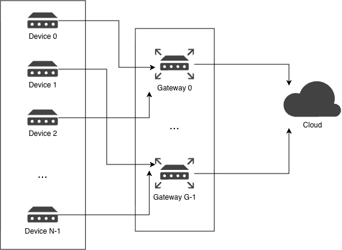
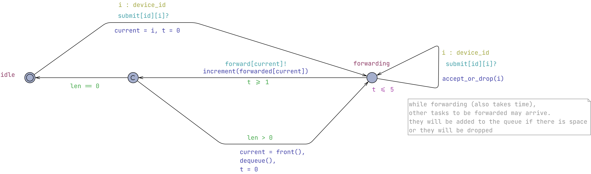
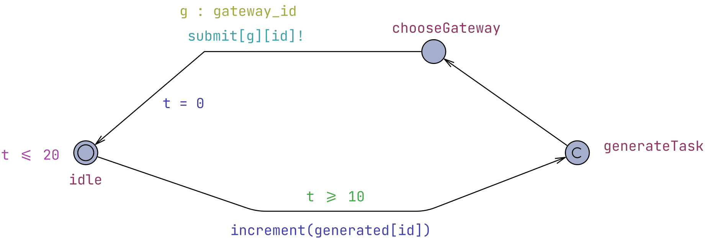
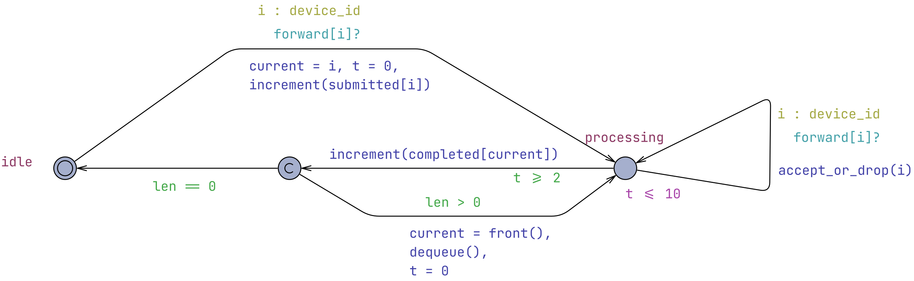
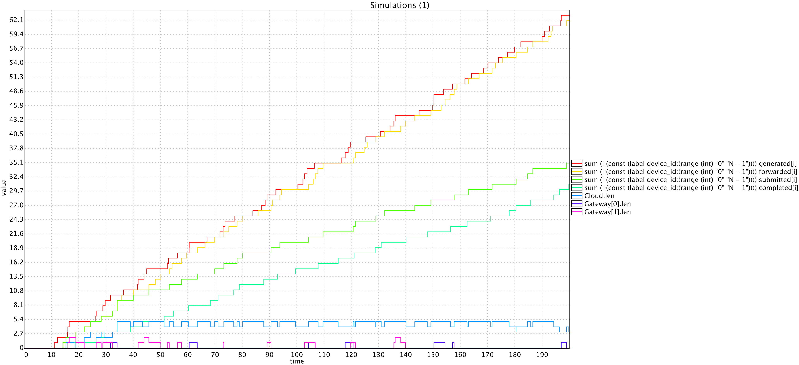

# Υλοποίηση IoT συστήματος με UPPAAL - Μέρος 5o

## Προσθήκη ενδιάμεσων Gateways

Μέχρι και το [προηγούμενο μέρος](IoTSystemV4.md) ακολουθήσαμε μια αρχιτεκτονική όπου Ν συσκευές (devices) στέλνουν εργασίες προς επεξεργασία σε έναν κεντρικό Cloud εξυπηρετητή. Τώρα προσθέτουμε στο σύστημα G gateways που είναι υπέυθυνες για την προώθηση των εργασιών από τις συσκευές στο cloud. Δηλαδή, η συσκευή στέλνει στην εργασία σε κάποιο gateway και αυτό με τη σειρά του το προωθεί στο cloud. Τα gateways έχουν και αυτά ουρές συγκεκριμένης χωρητικότητας το κάθε ένα.



*Figure 1. Architectural diagram.*

Η προσθήκη των gateways δεν αποσκοπεί μόνο στη δημιουργία μιας πιο ρεαλιστικής αρχιτεκτονικής IoT. Εισάγει ένα νέο επίπεδο ουρών και καθυστερήσεων, καθώς και ένα επιπλέον σημείο στο οποίο είναι δυνατόν να απορριφθούν εργασίες. Παράλληλα, όταν υπάρχουν περισσότερα από ένα gateways, κάθε συσκευή πρέπει να επιλέξει μέσω ποιου θα προωθήσει την εργασία της. Η επιλογή αυτή μπορεί να επηρεάσει την κατανομή του φόρτου, την πληρότητα των ουρών και τη συνολική απόδοση του συστήματος. Με αυτόν τον τρόπο, το μοντέλο δημιουργεί και ένα ουσιαστικό πρόβλημα λήψης αποφάσεων, το οποίο μπορεί αργότερα να μελετηθεί με το UPPAAL Stratego.

### Αλλαγές στο σύστημα

Αρχικά, για την επικοινωνία των συσκευών με τα gateways δηλώνεται ο δισδιάστατος πίνακας καναλιών:

```uppaal
urgent broadcast chan submit[G][N];
```

Κάθε στοιχείο του πίνακα αντιστοιχεί σε ένα συγκεκριμένο ζεύγος gateway–συσκευής. Επομένως, η έκφραση `submit[g][i]` αναφέρεται στο κανάλι μέσω του οποίου η συσκευή i στέλνει μία εργασία στο gateway g. Ο πρώτος δείκτης προσδιορίζει τον προορισμό της εργασίας, ενώ ο δεύτερος προσδιορίζει τη συσκευή που τη δημιούργησε.

Ο δισδιάστατος πίνακας είναι απαραίτητος επειδή τα κανάλια του UPPAAL δεν μεταφέρουν δεδομένα. Οι δύο δείκτες κωδικοποιούν στον ίδιο τον συγχρονισμό τόσο τον προορισμό όσο και την ταυτότητα της συσκευής. Ένα κοινό broadcast κανάλι θα μπορούσε να ενεργοποιήσει ταυτόχρονα όλα τα διαθέσιμα gateways, με αποτέλεσμα η ίδια εργασία να παραληφθεί περισσότερες από μία φορές. Άρα ο πρώτος δείκτης χρειάζεται για να παραληφθεί η εργασία μόνο από το επιλεγμένο gateway ενώ ο δέυτερος για να γνωρίζει από ποια συσκευή προέρχεται η εργασία. Η πληροφορία αυτή είναι απαραίτητη, επειδή το gateway αποθηκεύει το αναγνωριστικό της συσκευής στη μεταβλητή current και αργότερα προωθεί την εργασία προς το cloud μέσω `forward[current]!` Έτσι, η ταυτότητα της συσκευής διατηρείται σε όλη τη διαδρομή της εργασίας, ώστε να ενημερωθούν σωστά οι αντίστοιχοι μετρητές forwarded[i], submitted[i] και completed[i].

Για την επικοινωνία των gateways με το cloud αρκεί ένας μονοδιάστατος πίνακας:

```uppaal
broadcast chan forward[N];
```

Σε αυτή την περίπτωση δεν χρειάζεται δείκτης gateway, επειδή όλα τα gateways προωθούν τις εργασίες προς τον ίδιο προορισμό, δηλαδή το μοναδικό cloud. Χρειάζεται μόνο το αναγνωριστικό **της αρχικής συσκευής** `forward[i]` ώστε το cloud να γνωρίζει σε ποια συσκευή ανήκει η εργασία που λαμβάνει.

#### Το αυτόματο Gateway

Το νέο αυτόματο Gateway αναπαριστά το ενδιάμεσο επίπεδο μεταξύ των συσκευών και του cloud.

Κάθε gateway παραμετροποιείται με έναν αναγνωριστικό αριθμό ([όπως και οι συσκευές](/IoTSystemV1.md#Templates)). Αντίστοιχα, ορίζεται ένας νέος τύπος δεδομένων για τα αναγνωριστικά των gateways:

```uppaal
const int G = 2; // number of gateways
typedef int[0,G-1] gateway_id;
```

Με αυτόν τον τρόπο, κάθε gateway έχει ένα μοναδικό αναγνωριστικό από 0 έως G-1, όπως ακριβώς κάθε συσκευή αναγνωρίζεται μέσω του τύπου device_id. Η χρήση ξεχωριστού τύπου κάνει το μοντέλο σαφέστερο και επιτρέπει την παραμετροποίηση του template Gateway με την παράμετρο:

```uppaal
const gateway_id id
```

Το αυτόματο διαθέτει τις καταστάσεις *idle*, *forwarding* και μία committed ενδιάμεση κατάσταση για την άμεση επιλογή της επόμενης ενέργειας. Όταν το gateway βρίσκεται στην *idle* και λάβει μία εργασία μέσω

```uppaal
select i : device_id
submit[id][i]?
```

η εργασία αποθηκεύεται στη μεταβλητή `current = i`, το ρολόι μηδενίζεται με t = 0 και το αυτόματο μεταβαίνει στην *forwarding*.



*Figure 2. Gateway automaton.*

Η κατάσταση *forwarding* αναπαριστά τον χρόνο που απαιτείται για την προώθηση της εργασίας προς το cloud. Το invariant `t <= 5` και το guard `t >= 1` ορίζουν ότι η προώθηση διαρκεί από 1 έως 5 χρονικές μονάδες. Όταν ολοκληρωθεί η προώθηση, εκτελείται η μετάδοση: `forward[current]!` και αυξάνεται ο αντίστοιχος μετρητής `increment(forwarded[current])`.

Το κανάλι forward είναι broadcast αλλά όχι urgent, ώστε να επιτρέπεται η χρήση του χρονικού guard στην ίδια ακμή και να αποτυπώνεται η μεταβλητή διάρκεια της προώθησης.

Κάθε gateway διαθέτει επίσης δική του ουρά πεπερασμένης χωρητικότητας. Η ουρά υλοποιείται με τον πίνακα:

```uppaal
device_id list[QMAX];
```

Όσο το gateway βρίσκεται ήδη στην forwarding, μπορεί να δεχθεί νέες εργασίες μέσω μιας self-loop ακμής: `submit[id][i]?`.

Η συνάρτηση `accept_or_drop(i)` προσθέτει την εργασία στην ουρά όταν υπάρχει διαθέσιμος χώρος. Αν η ουρά έχει γεμίσει, η εργασία απορρίπτεται. Μετά την ολοκλήρωση της τρέχουσας προώθησης, το gateway εισέρχεται στην committed κατάσταση. Αν len > 0, αφαιρεί την πρώτη εργασία από την ουρά, την αποθηκεύει ως current, μηδενίζει το ρολόι και επιστρέφει στην forwarding. Αν len == 0, επιστρέφει στην *idle*. Η **committed** κατάσταση εξασφαλίζει ότι αυτή η απόφαση λαμβάνεται αμέσως, χωρίς να μεσολαβεί χρόνος.

#### Αλλαγές στο αυτόματο Device

Στο αυτόματο της συσκευής προστίθεται ένα νέο ενδιάμεσο στάδιο, ώστε η εργασία να μη μεταδίδεται πλέον απευθείας στο cloud. Μετά τη δημιουργία μιας εργασίας, η συσκευή μεταβαίνει από την κατάσταση *generateTask* στη νέα κατάσταση *chooseGateway*. Η κατάσταση *generateTask* παραμένει committed, ώστε η μετάβαση προς την επιλογή gateway να πραγματοποιείται χωρίς χρονική καθυστέρηση. Η δημιουργία της εργασίας συνεχίζει να καταγράφεται στην ακμή από την idle προς την generateTask, μέσω της εντολής `increment(generated[id])`.

Η χρονική συμπεριφορά της συσκευής δεν αλλάζει. Η συσκευή παραμένει στην *idle* για χρονικό διάστημα μεταξύ 10 και 20 μονάδων, όπως ορίζεται από το invariant `t <= 20` και το guard `t >= 10`.

Η σημαντικότερη αλλαγή βρίσκεται στην ακμή που ξεκινάει από την chooseGateway. Σε αυτή χρησιμοποιείται η έκφραση `select g : gateway_id` ώστε να επιλεγεί μη ντετερμινιστικά ένα από τα διαθέσιμα gateways. Η εργασία μεταδίδεται στη συνέχεια μέσω του καναλιού `submit[g][id]!`.

Ο πρώτος δείκτης προσδιορίζει το gateway που επιλέχθηκε, ενώ ο δεύτερος προσδιορίζει τη συσκευή που δημιούργησε την εργασία. Μετά την αποστολή, το ρολόι της συσκευής μηδενίζεται με t = 0 και το αυτόματο επιστρέφει στην *idle*. Επειδή το submit είναι urgent broadcast channel, η αποστολή πραγματοποιείται αμέσως μόλις η συσκευή φτάσει στην *chooseGateway*, χωρίς να εισάγεται επιπλέον χρονική καθυστέρηση.



*Figure 3. Device automaton.*

#### Αλλαγές στο αυτόματο Cloud

Το αυτόματο του cloud διατηρεί τη βασική του δομή, αλλά πλέον δεν λαμβάνει εργασίες απευθείας από τις συσκευές. Οι ακμές λήψης χρησιμοποιούν το κανάλι `forward[i]?` αντί για το παλαιότερο `submit[i]?`. Με αυτόν τον τρόπο, το cloud λαμβάνει μόνο εργασίες που έχουν προηγουμένως παραληφθεί και προωθηθεί από κάποιο gateway.



*Figure 4. Cloud automaton.*

Όταν το cloud βρίσκεται στην *idle*, μία εισερχόμενη εργασία γίνεται αμέσως η τρέχουσα εργασία `current = i`, το ρολόι μηδενίζεται (t = 0) και αυξάνεται ο μετρητής submitted.

Στη συνέχεια, το cloud μεταβαίνει στην *processing*. Η επεξεργασία διαρκεί από 2 έως 10 χρονικές μονάδες, όπως ορίζεται από `t >= 2` στο guard στην εξερχόμενη ακμή και `t <= 10` ως invariant της κατάστασης processing.

Όσο το cloud επεξεργάζεται μία εργασία, μπορεί να λάβει νέες μέσω της self-loop ακμής `forward[i]?`. Η συνάρτηση `accept_or_drop(i)` προσθέτει την εργασία στην ουρά εφόσον υπάρχει διαθέσιμος χώρος και αυξάνει τον μετρητή submitted[i]. Αν η ουρά έχει γεμίσει, η εργασία δεν γίνεται αποδεκτή. Μετά την ολοκλήρωση της επεξεργασίας αυξάνεται ο μετρητής `increment(completed[current])` και το αυτόματο μεταβαίνει σε committed κατάσταση. Από εκεί, αν η ουρά περιέχει εργασίες, επιλέγεται αμέσως η πρώτη με:

```uppaal
current = front(),
dequeue(),
t = 0
```

και ξεκινά νέα επεξεργασία. Αν η ουρά είναι κενή, το αυτόματο επιστρέφει στην *idle*.

### Μετρητές εργασιών

Με τις παραπάνω αλλαγές, ο κύκλος ζωής μιας εργασίας μετατρέπεται από:

```text
Device → Cloud
```

σε:

```text
Device → Gateway → Cloud
```

και καταγράφεται πλέον από τέσσερις διαφορετικούς μετρητές:

````text
generated → forwarded → submitted → completed
````

Έτσι, το μοντέλο μπορεί να διακρίνει τις εργασίες που δημιουργήθηκαν, εκείνες που προωθήθηκαν από κάποιο gateway, εκείνες που έγιναν αποδεκτές από το cloud και, τέλος, εκείνες που ολοκληρώθηκε η επεξεργασία τους. Αυτή η διάκριση επιτρέπει τη μελέτη της συμπεριφοράς τόσο του επιπέδου των gateways όσο και του cloud, καθώς και της επίδρασης που έχει η επιλογή gateway στην κατανομή του φόρτου και στις απορρίψεις (drops) εργασιών.

### Queries

Έχοντας ολοκληρώσει την επέκταση του μοντέλου με πολλαπλά gateways, μπορούμε πλέον να εξετάσουμε αν η νέα αρχιτεκτονική παρουσιάζει την αναμενόμενη συμπεριφορά. Τα ερωτήματα που ακολουθούν ελέγχουν αν οι εργασίες μπορούν να διασχίσουν όλα τα επίπεδα του συστήματος, αν οι ουρές των gateways και του cloud μπορούν να γεμίσουν και αν είναι δυνατόν να προκύψουν απορρίψεις εργασιών.

Ελέχγουμε ότι μι ασυσκευή μπορεί να ολοκληρώσει μια εργασία και ότι υπάρχει μια reachable κατάσταση όπου κάθε συσκευή έχει ολοκληρώσει τουλάχιστον μια εργασία.

```uppaal
E<> completed[0] > 0
E<> forall(i : device_id) completed[i] > 0
```

Στη συνέχεια, επιβεβαιώνουμε ότι οι gateways μπορούνε να προωθήσουν εργασίες.

```uppaal
E<> Gateway(0).forwarding
E<> Gateway(1).forwarding
```

Ελέγχουμε ότι μπορεί να υπάρξει κορεσμός τόσο στην ουρά των gateways όσο και του cloud.

```uppaal
E<> Gateway(0).len == Gateway(0).QMAX
E<> Gateway(1).len == Gateway(1).QMAX
E<> Cloud.len == Cloud.QMAX
```

Το παρακάτω query δείχνει ότι είναι δυνατόν μια εργασία να προωθηθεί από ένα gateway χωρίς μετά να γίνει αποδεκτή από το cloud.

```uppaal
E<> forwarded[0] > submitted[0]
```

#### Αντικατάσταση συμβολικών με πιθανοτικά query

Όπως έχουμε δει και σε προηγούμενα μέρη προκύπτει το φαινόμενο του state-space explosion. Για παράδειγμα, το query `E<> forwarded[0] > submitted[0]` εκτελείται κανονικά για 3 συσκευές αλλά έγινε πολύ αργό όταν τις αυξάνουμε σε 5. Σε αυτές τις περιπτώσεις μια πρακτική λύση είναι να υπολογίσουμε την αντίστοιχη πιθανότητα. Εδώ, αν εκτελέσουμε το

```uppaal
Pr[<=200](<> forwarded[0] > submitted[0])
```

θα δούμε ότι έχουμε πιθανότητα ≥ 0.95 για διάστημα εμπιστοσύνης 95%. Ακόμα και αν δεν μπορεί να θεωρηθεί ισοδύναμο με το συμβολικό query μας δείχνει ότι πρακτικά μάλλον είναι αληθές.

#### Προσομοίωση

Το παρακάτω query εκτελεί μία προσομοίωση του μοντέλου για έως 200 χρονικές μονάδες και απεικονίζει την εξέλιξη διαφόρων μεγεθών στον χρόνο.

```uppaal
simulate [<=200] {
    sum(i : device_id) generated[i],
    sum(i : device_id) forwarded[i],
    sum(i : device_id) submitted[i],
    sum(i : device_id) completed[i],
    Gateway(0).len,
    Gateway(1).len,
    Cloud.len
}
```

Οι τέσσερις πρώτες εκφράσεις υπολογίζουν το συνολικό πλήθος εργασιών σε κάθε στάδιο του συστήματος, αθροίζοντας τις αντίστοιχες τιμές για όλες τις συσκευές. Έχουμε με τη σειρά: πόσες εργασίες έχουν δημιουργηθεί συνολικά, πόσες έχουν προωθηθεί από κάποιο gateway, πόσες έχουν γίνει αποδεκτές από το cloud και πόσες έχουν ολοκληρώσει την επεξεργασία τους. Οι τρεις τελευταίες εκφράσεις παρουσιάζουν το μήκος της ουράς κάθε gateway και του cloud σε κάθε χρονική στιγμή.

Η συγκεκριμένη προσομοίωση έγινε για Ν = 5 συσκευές, G = 2 gateways, Qmax = 3 στα gateways και Qmax = 5 στο cloud.



*Figure 5. Simulation result.*

Το διάγραμμα που παράγεται επιτρέπει να παρατηρήσουμε ολόκληρη τη ροή των εργασιών μέσα στο σύστημα. Οι διαφορές ανάμεσα στις αθροιστικές καμπύλες δείχνουν εργασίες που είτε βρίσκονται ακόμη σε ενδιάμεσο στάδιο είτε έχουν απορριφθεί, ενώ οι τιμές των len δείχνουν πότε δημιουργείται συμφόρηση στις ουρές. Σημειώνουμε ότι στο simulate query, το αποτέλεσμα αφορά μία ενδεικτική εκτέλεση του μοντέλου και όχι εξαντλητικό έλεγχο όλων των δυνατών συμπεριφορών.

### Επόμενο βήμα

Στην παρούσα έκδοση, η επιλογή gateway πραγματοποιείται μη ντετερμινιστικά. Επομένως, το μοντέλο περιγράφει όλες τις δυνατές επιλογές, χωρίς να εφαρμόζει κάποια συγκεκριμένη πολιτική δρομολόγησης. Η επιλογή αυτή μπορεί στη συνέχεια να μετατραπεί σε πρόβλημα ελέγχου, ώστε να εξεταστεί αν το UPPAAL Stratego μπορεί να μάθει μία στρατηγική που περιορίζει τις απορρίψεις εργασιών ή βελτιώνει την απόδοση του συστήματος.

### Version 5 xml

Μπορείτε να δείτε το παραπάνω σύστημα στο UPPAAL ανοίγοντας αυτό το αρχείο xml: [IoTSystemV5.xml](models/IoTSystemV5.xml).
