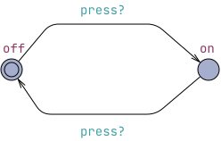
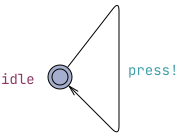
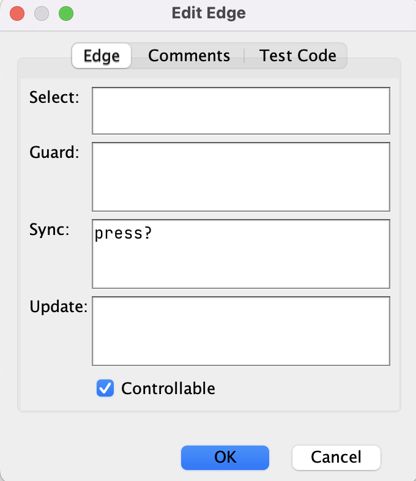
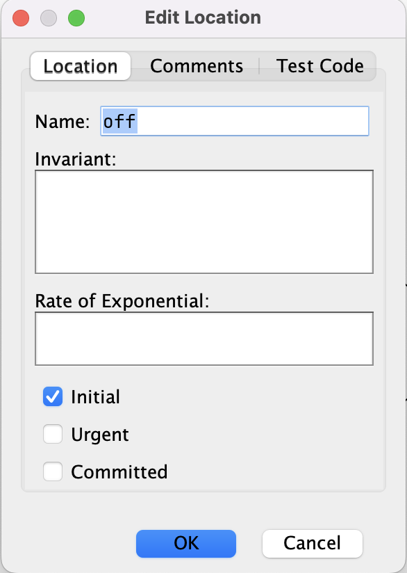
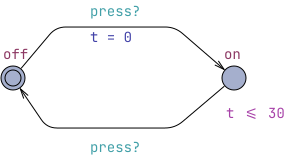

# Λάμπα με χρονοδιακόπτη

Για να δούμε κάποιες βασικές έννοιες θα μοντελοποιήσουμε το παράδειγμα μιας λάμπας η οποία ανάβει με το πάτημα ενός κουμπιού του χρήστη και σβήνει είτε με το πέρασμα 30 δευτερολέπτων είτε αν ο χρήστης πατήσει ξανά το κουμπί μέσα σε αυτό το διάστημα.

## Καταστάσεις (locations) και μεταβάσεις (edges)

Η λάμπα μπορεί επομένως να βρίσκεται σε δύο καταστάσεις, off και on, οι οποίες αναπαριστούνται από δυο **καταστάσεις (locations)** στο μοντέλο μας. Χρειάζεται να ορίσουμε και ένα δεύτερο μοντέλο, αυτό του χρήστη για να μοντελοποιήσουμε το πάτημα του κουμπιού. Αυτό αποτελείται από μια κατάσταση. Οι καταστάσεις ενώνονται με **μεταβάσεις (edges)**.

Αυτή τη στιγμή το σύστημά μας έχει ως εξής:

*Figure 1. Initial lamp system.*

Στα global declaration του συστήματος έχουμε ορίσει ένα κανάλι με το όνομα press μέσω του οποιού συγχρονίζονται τα δύο αυτόματα.

`chan press;`

Ο συγχρονισμός είναι μια από τις ιδιότητες των ακμών, μαζί με την ανάθεση (update) και τα guards που θα δούμε παρακάτω.

*Figure 2. GUI edge menu.*

Αντίστοιχα, στις καταστάσεις μπορείς να ορίσεις invariants αλλά και να επιλέξεις ανάμεσα σε ειδικούς τύπους καταστάσεων: initial(αρχική), committed και urgent.

*Figure 3. GUI location menu.*

Προς το παρόν το αυτόματο της λάμπας μας συγχρονίζεται μόνο με το κουμπί που πατάει ο χρήστης αλλά εμείς θέλουμε να μοντελοποιήσουμε και τη λειτουργία του χρονοδιακόπτη. Ορίζουμε λοιπόν ένα ρολόι t.

`clock t;`

Το ρολόι πρέπει να μηδενίζεται για να ξεκινάει η χρονομέτρηση κάθε φορά που ανάβει η λάμπα. Γι'αυτό κάνουμε χρήση του update της μετάβασης από το on στο off. Για να βεβαιωθούμε ότι η λάμπα δε θα μείνει αναμμένη πάνω από 30 χρονικές μονάδες ορίζουμε ένα invariant t <= 30 στην κατάσταση `on`.

Το αυτόματο της λάμπας έχει πλέον αυτή τη μορφή:

*Figure 4. Final lamp automaton.*

Τα update είναι εκφράσεις (expressions) που αποτιμούνται όταν το αυτόματο ακολουθεί αυτή την μετάβαση. Συνήθως, πρόκεται για αναθέσεις σε μεταβλητές όπως το ρολόι στην περίπτωσή μας.

Τα invariants είναι boolean εκφράσεις της μορφής t <= e ή t < e όπου t είναι ένα ρολόι και e ένας ακέραιος. Πρακτικά, ορίζουν το μέγιστο χρόνο που το αυτόματο μπορεί να παραμείνει στο συγκεκριμένο location.

Τώρα που έχουμε την τελική μορφή του συστήματος μας μπορούμε να κάνουμε προσομοίωση ή να χρησιμοποιήσουμε τον verifier του UPPAAL για να κάνουμε έλεγχο ορθότητας.

## Queries

Ακολουθούν μερικά queries πάνω στο σύστημα μας.

- `A[] not deadlock` δηλαδή ότι για κάθε δυνατό μονοπάτι το σύστημα δε μπορεί να βρεθεί deadlock. Είναι αληθές.
- `A[] not (Lamp.on and t > 30)` δηλαδή οτί δεν υπάρχει κατάσταση του συστήματος όπου μπορεί να είναι η λάμπα αναμμένη (το αυτόματο της λάμπας στην κατάσταση on) και το ρολόι να είναι μετά το 30. Είναι αληθές.

Σημειώνουμε τις βασικές εκφράσεις της γλώσσας query του UPPAAL παρακάτω:

| Query    | Εξήγηση |
| -------- | ------- |
| A[] p | για όλα τα μονοπάτια ισχύει πάντα το p   |
| E[] p    | υπάρχει μονοπάτι στο οποίο ισχύει πάντα το p    |
| A<> p    | όλα τα μονοπάτια μπορούν να φτάσουν σε κατάσταση που ισχύει το p|
| E<> p  | υπάρχει μονοπάτι που μπορεί να φτάσει σε κατάσταση που ισχύει το p|

### Σημειώση για τις μεταφράσεις

Μεταφράζουμε τα locations των χρονισμένων αυτομάτων ως καταστάσεις και τα edges ως μεταβάσεις.

Προκύπτει μια αμφισημία γιατί χρειάζεται να μεταφράσουμε και το state ή extended state του χρονισμένου αυτομάτου που αποτελείσται από την κατάσταση (location) ΚΑΙ την τιμή του ρολογιού (και στην περίπτωση των extended timed automata του UPPAAL KAI και από την τιμή των υπόλοιπων μεταβλητών και δομών δεδομένων που σχετίζονται με το αυτόματο). Θα ανφερόμαστε στο state ή extended state ως **συνολική κατάσταση του αυτομάτου**.
