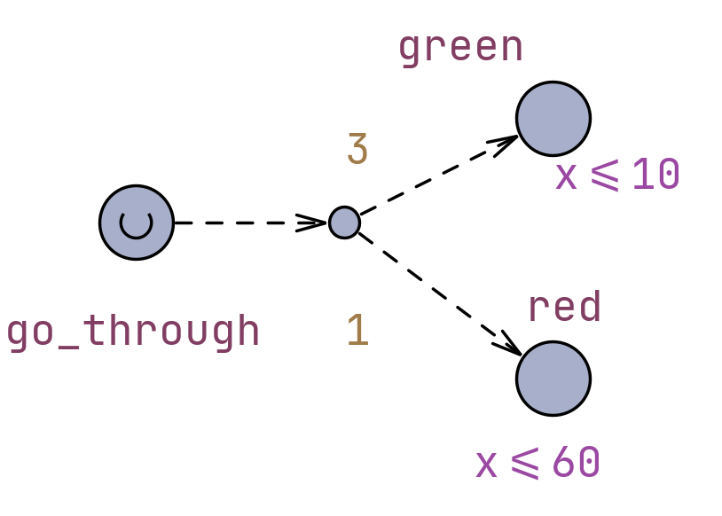
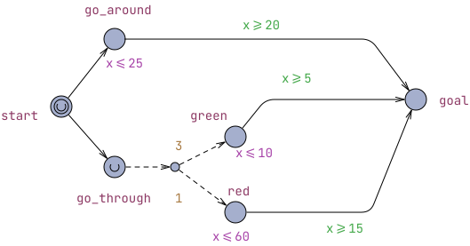
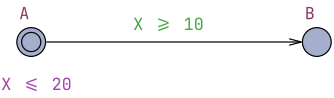
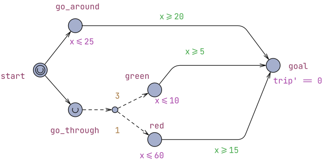
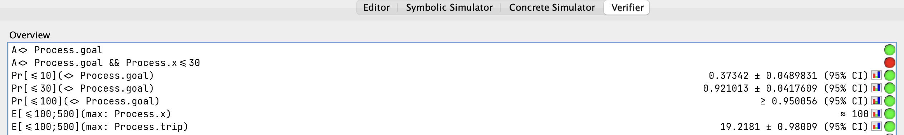

# Φανάρια - UPPAAL SMC

Το UPPAAL SMC (Statistical Model Checking) είναι μια ενσωματωμένη επέκταση που επεκτείνει τις δυνατότητες του κλασικού UPPAAL, χωρίς να εισάγει μια νέα γλώσσα μοντελοποίησης, χρησιμοποιώντας τις ίδιες βασικές έννοιες που παρουσιάστηκαν και πριν.

Οι βασικές διαφορές είναι:

- Τα μοντέλα δεν είναι πλέον αυστηρά δίκτυα χρονισμένων αυτόματων (timed automata), αλλά δίκτυα αυτομάτων των οποίων η συμπεριφορά μπορεί να εξαρτάται από στοχαστικά χαρακτηριστικά. Τα ρολόγια των αυτομάτων μπορούν να αυξάνονται με διάφορους ρυθμούς.

- Ο τρόπος ανάλυσης του μοντέλου. Ενώ το κλασικό UPPAAL πραγματοποιεί εξαντλητική επαλήθευση (exhaustive verification) κατασκευάζοντας και εξερευνώντας ολόκληρο τον χώρο καταστάσεων (state space), το UPPAAL SMC βασίζεται σε επαναλαμβανόμενες προσομοιώσεις και στατιστικές μεθόδους για την εκτίμηση των ζητουμένων.

Αυτό επεκτείνει τις δυνατότητες του UPPAAL που ήταν κυρίως χρήσιμο για την τυπική επαλήθευση (formal verification) συστημάτων και μπορούσαμε να κάνουμε ερωτήματα (queries) πάνω στην προσπελασιμότητα (reachability), ασφάλεια (safety) και προόδο (liveness), και μπορούμε πλέον να κάνουμε queries πάνω σε πιθανότητες και αναμενόμενες τιμές.

## Παράδειγμα Φανάρια

Έστω πως ένας οδηγός θέλει να φτάσει από την αρχική τοποθεσία του *start* στον τελικό προορισμό του *goal*. Υπάρχουν δυο διαδρομές που μπορεί να ακολουθήσει είτε κυκλικά εκτός της πόλης (*go_around*), είτε περνόντας μέσα από την πόλη (*go_through*) όπου όμως θα συναντήσει φανάρι.

Το φανάρι έχει πιθανότητα p = 1/4 να είναι κόκκινο και 1 - p = 3/4 να είναι πράσινο. Αυτό μοντελοποιείται με την λειτουργικότητα των **διακλαδώσεων (branches)** που προσφέρει το UPPAAL.

*Figure 1. Branch feature.*

Χρησιμοποιώντας το εργαλείο branch μπορούμε να δημιουργήσουμε διακλαδώσεις και να ορίσουμε βάρος για κάθε ακμή τους. Η πιθανότητα το αυτόματο να ακολουθήσει  την κάθε ακμή-ετάβαση είναι αντιστρόφως ανάλογη του βάρους της ακμής προς το άθροισμα των βαρών όλων των ακμών που ξεκινάνε από αυτη τη διακλάδωση (branchpoint).

Συνεχίζουμε την περιγραφή του μοντέλου ορίζοντας ως προδιαγραφές ότι ο δρόμος εκτός πόλης παίρνει στον οδηγό ανάμεσα σε 20 και 25 μονάδες χρόνου. Αν περάσει μέσα από την πόλη 5 έως 10 αν "πετύχει" το φανάρι πράσινο και 15 ως 60 αν το πετύχει κόκκινο. Το πλήρες αυτόματο φαίνεται παρακάτω.

*Figure 2. Traffic Lights Automaton.*

Πριν προχωρήσουμε σε στατιστικά ερωτήματα, προσφέρεται για να δούμε άλλα δυό βασικά features του UPPAAL που δεν είδαμε στο προηγούμενο παράδειγμα.

Αρχικά οι **συνθήκες μετάβασης (guards)** είναι άλλο ένα χαρακτηριστικό των ακμών και ορίζει ότι η μετάβαση είναι δυνατή αν και μόνο αν η συνθήκη είναι αληθής. Εδώ, βλέπουμε guards στις μεταβάσεις από τις τοποθεσίες *go_around*, *green*, *red* στο *goal*.

Επιπλέον, βλέπουμε ότι οι τοποθεσίες *start* και *go_through* έχουν τους ειδικούς τύπους **committed** και **urgent** αντίστοιχα. Σε αυτούς τους τύπους τοποθεσιών δεν "επιτρέπεται" να περάσει χρόνος και πρέπει να ακολουθηθεί μια μετάβαση άμεσα. Στο παράδειγμά μας μπορούμε να το καταλάβουμε διαισθητικά σκεπτόμενοι ότι δεν θα χρειαστεί χρόνος να αποφασίσει ο οδηγός ανάμεσα στις *go_around* και *go_through*. Επίσης, ότι μόλις φτάσει στο φανάρι θα είναι άμεσα σε μια από τις δύο καταστάσεις, πράσινο ή κόκκινο.

Επιστρέφοντας στο παράδειγμα βλέπουμε ότι ο συνδυασμός guard και invariant επιτρέπει να μοντελοποιήσουμε χρονικά διαστήματα που ακολουθούν την κανονική κατανομή.

> [!tip]
> Το παρακάτω αυτόματο θα μείνει στο Α το τουλάχιστον 10 και το πολύ 20 χρονικές μονάδες.
>
> 

Παρακάτω παρουσιάζουμε κάποια queries που εκτελέσαμε για να μελετήσουμε το μοντέλο.

- `A<> Process.goal` Αρχικά ελέγχουμε ότι για κάθε εκτέλεση υπάρχει μονοπάτι όπου ο οδηγός φτάνει στον προορισμό του. Είναι αληθές.
- `A<> Process.goal && time<=30` Εδώ ελέγχουμε αν υπάρχει πάντα διαδρομή με την οποία μπορεί να φτάσει ο οδηγός στον προορισμό του σε λιγότερο από 30 λεπτά. Είναι ψευδές. Θα υπολογίσουμε όμως παρακάτω την **πιθανότητα** να φτάσει σε λιγότερο από 30 λεπτά.

Συνεχίζουμε με queries πιθανοτήτων:

- `Pr[<=10](<> Process.goal)` δηλαδή ποιά είναι η πιθανότητα να φτάσουμε στην τοποθεσία *goal* σε λιγότερες ή 10 χρονικές μονάδες. Παίρνουμε αποτέλεσμα 0.37342 ± 0.0489831  (95%  CI)
- `Pr[<=30](<> Process.goal)` δηλαδή ποιά είναι η πιθανότητα να φτάσουμε στην τοποθεσία *goal* σε λιγότερες ή 30 χρονικές μονάδες. Παίρνουμε αποτέλεσμα 0.921013 ± 0.0481761 (95%  CI)
- `Pr[<=100](<> Process.goal)` δηλαδή ποιά είναι η πιθανότητα να φτάσουμε στην τοποθεσία *goal* σε λιγότερες ή 100 χρονικές μονάδες. Παίρνουμε αποτέλεσμα  ≥0.950056  (95%  CI)

Σημειώνουμε ότι η τελευταία πιθανότητα δίνεται έτσι γιατί το διάστημα εμπιστοσύνης που έχουμε επιλέξει είναι 95%.

Με το query `Pr[<=10](<> Process.goal)` το UPPAAL τρέχει έναν αριθμό στοχαστικών προσομοιώσεων και εκτιμά την πιθανότητα του Process.goal να γίνει αληθές (δηλαδή να φτάσουμε στην εκτέλεση στο location *goal*) μέσα σε 10 μονάδες χρόνου. Το πόσες προσομοιώσεις θα τρέξει εξαρτάται από στατιστικές παραμέτρους που μπορούμε να αλλάξουμε.

Λογικό είναι τώρα να θέλουμε μια εκτίμηση του συνολικού χρόνου που χρειάζεται ο οδηγός για να φτάσει στον προορισμό του. Θα ορίσουμε ένα νέο ρολόι `trip` το οποίο θα σταματάμε όταν φτάνουμε στο *goal*. Αυτό το κάνουμε γιατί το ρολόι συνεχίζει να προχωράει για όσο τρέχει η προσομοίωση. Εμείς θέλουμε όμως να σταματήσει μόλις η προσομοίωση φτάσει στο *goal*. Αυτό γίνεται ορίζοντας invariant `trip' == 0` σε εκείνη την τοποθεσία. Πρόκειται για άλλη μια δυνατότητα του UPPAAL να αλλάζουμε το ρυθμό του ρολογίου τον οποίο στη συγκεκριμένη περίπτωση μηδενίζουμε ώστε να το σταματήσουμε.

*Figure 3. Traffic Lights Automaton updated.*

Τώρα μπορούμε να εκτιμήσουμε τη διάρκεια της διαδρομής.

- `E[<=100; 500](max: Process.trip)` δηλαδή ποιά είναι η αναμενόμενη διάρκεια του ταξιδιού (η μέγιστη τιμή του ρολογιού τριπ) ορίζοντας διάρκεια εκτέλεσης 100 χρονικές μονάδες και 500 επαναλήψεις της προσομοίωσης. Παίρνουμε αποτέλεσμα 19.2181 ± 0.98009  (95%  CI)

*Figure 4. Query results.*
