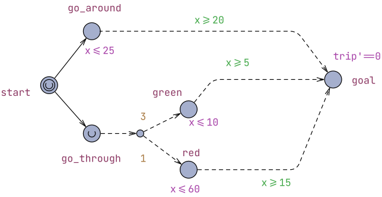

# Φανάρια - UPPAAL Stratego

Το UPPAAL Stratego επεκτείνει τις δυνατότητες του UPPAAL, επιτρέποντας όχι μόνο την ανάλυση της συμπεριφοράς ενός συστήματος, αλλά και τη σύνθεση στρατηγικών για τη λήψη αποφάσεων. Σε αντίθεση με το Statistical Model Checking, όπου αξιολογούνται ιδιότητες ενός ήδη καθορισμένου μοντέλου, το Stratego επιδιώκει να υπολογίσει μια στρατηγική που βελτιστοποιεί έναν ή περισσότερους στόχους, όπως ο χρόνος εκτέλεση ή το συνολικό κόστος. Στη συνέχεια παρουσιάζονται οι βασικές έννοιες και οι δυνατότητες του UPPAAL Stratego μέσα από ένα απλό παράδειγμα.

*Σημείωση: Πλέον τόσο το SMC όσο και το Stratego είναι ενσωμωατωμένα στην τρέχουσα έκδοση του UPPAAL.*

## Παράδειγμα

Θα χρησιμοποιήσουμε το μοντέλο του προηγούμενου παραδείγματος. Θυμίζουμε ότι στο προηγούμενο παράδειγμα υπήρχε όπου ο οδηγός ακολουθούσε έναν από δυο δρόμους (*go_around* ή *go_through*). Αυτή η μετάβαση στις προσομοιώσεις του μοντέλου, δεν γίνοταν με βάση κάποια στρατηγική αλλά τυχαία. Το UPPAAL δεν μας βοηθούσε να ανακαλύψουμε τη βέλτιστη διαδομή.

Εδώ παρουσιάζεται η χρησιμότητα του Stratego.

Πριν συνεχίσουμε πρέπει να διακρίνουμε τις μεταβάσεις ανάμεσα σε **controllable** και **uncontrollable**. Οι controllable μεταβάσεις αντιστοιχούν σε αποφάσεις που μπορεί να λάβει ο ελεγκτής (controller), όπως για παράδειγμα η επιλογή δρόμου του οδηγού στην περίπτωση μας. Αντίθετα, οι uncontrollable μεταβάσεις αναπαριστούν γεγονότα που εξελίσσονται ανεξάρτητα από τον ελεγκτή, όπως η κατάσταση ενός φαναριού ή γενικότερα η συμπεριφορά του περιβάλλοντος. Στόχος του Stratego είναι να συνθέσει μια στρατηγική που επιλέγει τις controllable μεταβάσεις με τον βέλτιστο δυνατό τρόπο, λαμβάνοντας υπόψη ότι οι uncontrollable μεταβάσεις δεν μπορούν να ελεγχθούν.

Χρειάζεται πρακτικά να ορίσουμε uncontrollable και τις 3 μεταβάσεις προς το goal ακόμα και αν στη συγκεκριμένη περίπτωση υπάρχει μόνο μια μετάβαση ανάμεσα στις δυο τοποθεσίες. Οι ακμές στη διακλάδωση είναι εξ ορισμού ήδη uncontrollable αφού είναι πιθανοτικές.

*Figure 1. Traffic Lights Automaton.*

Στο διάγραμμα οι uncontrollable μεταβάσεις φαίνονται ως διακεκομμένες.

Ορίσουμε μια στρατηγική για να ελαχιστοποιήσουμε το χρόνο που χρειάζεται για να φτάσουμε στο στόχο:

`strategy Fastest = minE(Process.trip) [<=100] : <> Process.goal`

Το παράδειγμα είναι αρκετά απλό οπότε μπορούμε να υπολογίσουμε και μόνοι μας ότι η βέλτιστη στρατηγική είναι η επιλογή του *go_through*, αφού η πιθανότητα πράσινου φαναριού είναι αρκετά μεγάλη.

Για να το διαπιστώσουμε θα τρέξουμε το ίδιο query αναμενόμενης τιμής που είχαμε χρησιμοποιείσει και στη προηγούμενο παράδειγμα με τη διαφορά ότι τώρα θα ορίσουμε ότι πρέπει να ακολουθηθεί η στρατηγική Fastest.

`E[<=100;500](max: Process.trip) under Fastest`

Πράγματι τρέχοντας το παίρνουμε καλύτερες τιμές από τις εκτελέσεις χωρίς στρατηγική, ~15 έναντι ~19. Αξίζει να συγκρίνουμε όμως και την πιθανότητα να έχουμε φτάσει πριν τις 30 μονάδες χρόνου `Pr[<=30](<> Process.goal) under Fastest`. Εδώ έχουμε μικρότερη πιθανότητα από πριν, ~0.81 έναντι 0.9 που είχαμε χωρίς στρατηγική. Είναι λογικό καθώς η γρηγορότερη στρατηγική είναι να πηγαίνει από τα φανάρια και υπάρχει η, έστω και μικρότερη, πιθανότητα να μείνει για πολύ χρόνο στο κόκκινο. Και τα δυο αποτελέσματα ταιριάζουν με αυτό που περιμέναμε διαισθητικά.

|| χωρίς στρατηγική    | με τη στρατηγική Fastest |
| ------- | -------- | ------- |
| Pr[<=30](<> Process.goal) | 0.90 ± 0.04 | 0.81 ± 0.04 |
| E[<=100;500](max: Process.trip) | 19.23 ± 0.98 | 15.21 ± 1.27|

Αν αντιστρέψουμε τα βάρη στη διακλάδωση και κάνουμε την πιθανότητα του κόκκινου 0.75, περιμένουμε να αλλάξει η γρηγορότερη στρατηγική και να ακολουθεί το *go_around* . Το επιβεβαιώνουμε τρέχοντας το `E[<=100;500](max: Process.trip)` και βλέποντας ότι έχει αυξηθεί σε ~22.

Ωστόσο, η ελαχιστοποίηση του χρόνου/κόστους δεν είναι ο μόνος τρόπος να ορίσουμε στρατηγικές στο UPPAAL Stratego.
